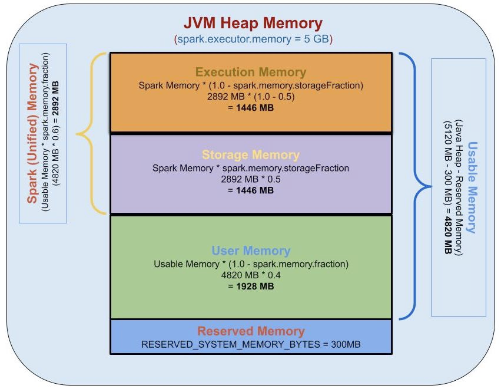

# apache spark

# RDD - **Resilient Distributed Datasets**

- fine-grained updates - update to one record in a database
- *coarse-grained* transformations (*e.g.,* map, filter and join)
- Although individual RDDs are immutable, it is possible to implement mutable state by having multiple RDDs to represent multiple versions of a dataset. We made RDDs immutable to make it easier to describe lineage graphs.
- RDDs are best suited for batch applications that apply the same operation to all elements of a dataset.
- RDDs would be less suitable for applications that make asynchronous fine-grained updates to shared state, such as a storage system for a web application or an incremental web crawler. For these applications, it is more efficient to use systems that perform traditional update logging and data check pointing, such as databases.
- users can control two other aspects of RDDs: ***`persistence`*** and ***`partitioning`***
    - *[**persistence**](https://spark.apache.org/docs/latest/rdd-programming-guide.html#rdd-persistence)*
        
        call a *`persist`* method to indicate which RDDs they want to reuse in future operations.
        
    - ***`partitioning`***

### transformations and actions

*`transformations`* are lazy operations that define a new RDD, while *`actions`* launch a computation to return a value to the program or write data to external storage.

#### Transformations
```
map(f :T⇒U) : RDD[T] ⇒ RDD[U]
filter(f:T⇒Bool) : RDD[T] ⇒ RDD[T]
flatMap( f : T ⇒ Seq[U]) : RDD[T] ⇒ RDD[U]
sample(fraction : Float) : RDD[T] ⇒ RDD[T] (Deterministic sampling)
groupByKey() : RDD[(K, V)] ⇒ RDD[(K, Seq[V])]
reduceByKey( f : (V, V) ⇒ V) : RDD[(K, V)] ⇒ RDD[(K, V)]
union() : (RDD[T], RDD[T]) ⇒ RDD[T]
join() : (RDD[(K, V)], RDD[(K, W)]) ⇒ RDD[(K, (V, W))]
cogroup() : (RDD[(K, V)], RDD[(K, W)]) ⇒ RDD[(K, (Seq[V], Seq[W]))]
crossProduct() : (RDD[T], RDD[U]) ⇒ RDD[(T, U)]
mapValues( f : V ⇒ W) : RDD[(K, V)] ⇒ RDD[(K, W)] (Preserves partitioning)
sort(c : Comparator[K]) : RDD[(K, V)] ⇒ RDD[(K, V)]
partitionBy( p : Partitioner[K]) : RDD[(K, V)] ⇒ RDD[(K, V)]
```

#### Actions 
```
count() : RDD[T] ⇒ Long
collect() : RDD[T] ⇒ Seq[T]
reduce(f:(T,T)⇒T) : RDD[T] ⇒ T
lookup(k : K) : RDD[(K, V)] ⇒ Seq[V] (On hash/range partitioned RDDs)
save(path : String) : Outputs RDD to a storage system, e.g., HDFS |
```
- In addition to these operators, users can ask for an RDD to `persist`. Furthermore, users can get an RDD’s partition order, which is represented by a `Partitioner` class, and partition another dataset according to it. Operations such as *`groupByKey`*, *`reduceByKey`* and *`sort`* automatically result in a hash or range partitioned RDD.

```scala
var x = 5
rdd.map(_ + x) // to add 5 to each element of an RDD

**// NOTE: We save each closure at the time it is created, 
// so that the map in this example will always add 5 even if x changes.**
```

### **Representing RDDs**

In a nutshell, we propose representing each RDD through a common interface that exposes five pieces of information:

- a set of *`partitions`*, which are atomic pieces of the dataset
- a set of *`dependencies`* on parent RDDs
- a function for computing the dataset based on its parents
- metadata about partitioning scheme
- metadata about data placement

| Operation | Meaning			 |
| --- | --- |
| partitions() | Return a list of Partition objects |
| preferredLocations(p) | List nodes where partition p can be
accessed faster due to data locality |
| dependencies() | Return a list of dependencies |
| iterator(p, parentIters) | Compute the elements of partition p given iterators for its parent partitions |
| partitioner() | Return metadata specifying whether the RDD is hash/range partitioned |
- **`dependency type`**
    - ***narrow* dependencies:** where each partition of the parent RDD is used by at most one partition of the child RDD
    - ***wide* dependencies:** where multiple child partitions may depend on it.
    
    For example, *`map`* leads to a narrow dependency, while *`join`* leads to to wide dependencies (unless the parents are hash-partitioned).
    
    
    

**HDFS files:** The input RDDs in our samples have been files in HDFS. For these RDDs, *partitions* returns one partition for each block of the file (with the block’s offset stored in each Partition object), *preferredLocations* gives the nodes the block is on, and *iterator* reads the block.

***`map`*:** Calling *map* on any RDD returns a MappedRDD object. This object has the same partitions and preferred locations as its parent, but applies the function passed to *map* to the parent’s records in its *iterator* method.

***`union`*:** Calling *union* on two RDDs returns an RDD whose partitions are the union of those of the parents. Each child partition is computed through a narrow dependency on the corresponding parent.

**Note:** that our *union* operation does not drop duplicate values.

***`sample`*:** Sampling is similar to mapping, except that the RDD stores a random number generator seed for each partition to deterministically sample parent records.

***`join`*:** Joining two RDDs may lead to either two narrow dependencies (if they are both hash/range partitioned with the same partitioner), two wide dependencies, or a mix (if one parent has a partitioner and one does not). In either case, the output RDD has a partitioner (either one inherited from the parents or a default hash partitioner).


# Spark architecture 


- The first task is to interpret the code with the help of an interpreter. If you use the Scala code, then the Scala interpreter interprets the code.
- Spark then creates an operator graph when the code is entered in the Spark console.
- When the action is called on Spark RDD, the operator graph is submitted to the DAG Scheduler.
- The operators are divided into stages of task by the **DAG Scheduler**. The stage consists of detailed step-by-step operation on the input data. The operators are then pipelined together.
- The stages are then passed to the **Task Scheduler** which launches the task via the cluster manager to work on independently without the dependencies between the stages.
- The worker nodes then execute the task.

Each RDD keeps track of the pointer to one/more parent RDD along with its relationship with the parent. For example, consider the operation `val childB=parentA.map()` on RDD, then we have the RDD childB that keeps track of its parentA which is called **RDD lineage**.

# Memory management in spark

## JVM heap Memory usage in spark

| Execution | Storage |
| --- | --- |
| Memory which is used to buffer intermediate results as we perform computation. For e.g. if we are doing group by, we have to put values in hashmap so we need memory to built hashmap. | Memory used to cache data which will be reused later. |
| It is sort lived, as soon as you finished the computation and result of that computation have all been consumed then you can immediately release execution memory | It is not automatically released, we explicitely release or let LRU (least recently used) take care of it. |

In Spark, execution and storage share a unified region (M). When no execution memory is used, storage can acquire all the available memory and vice versa. Execution may evict storage if necessary, and can spilled cached data to disk if required. But Storage can not use the execution memory in use.

**Why evict storage, not execution ?**
As spilled execution data will always be read back from disk where as cached data may not. So it does not make sense to spilled execution data, instead we spilled storage data to disk.

**What if the application relies on caching ?**
Applications that do use caching can reserve a minimum storage space (R) where their data blocks are immune to being evicted.

## **Usage of off-heap memory in spark**

To use off-heap memory we need to set `spark.memory.offheap.enabled=true` and `spark.memory.offHeap.size=2G`. The amount of off-heap storage memory is computed as maxOffHeapMemory * spark.memory.storageFraction. The remaining value is reserved for the "execution" memory. The execution memory means the storage of tasks files as for instance the ones coming from shuffle operation.

Persist/cache the intermediate data on off-heap: `rdd.persist(StorageLevel.OFF_HEAP)`

- [Can off-heap memory be used to store broadcast variables?](https://stackoverflow.com/questions/69587778/spark-using-off-heap-memory)
    - **no**, you cannot use `StorageLevel.OFF_HEAP` for broadcast variables.

## Memory configurations of executor

- `spark.executor.memory` - executor memory is divided in multiple part using below properties
    - Reserved Memory - 300 MB
    - `spark.memory.fraction` - Fraction of (`spark.executor.memory` - 300MB(Reserved memory)) used for execution and storage.
        - `spark.memory.storageFraction` - Amount of storage memory immune to eviction, expressed as a fraction of the size of the region set aside by `spark.memory.fraction`
    - **User Memory** - (`spark.executor.memory` - 300MB)*(1 - `spark.memory.fraction`). Memory for user data structures, internal metadata in Spark, and safeguarding against OOM errors in the case of sparse and unusually large records. `?`
    
    
    
- `spark.executor.memoryOverhead` -
    - `spark.executor.memoryOverheadFactor` - 0.10
    
    `spark.executor.memory` * `spark.executor.memoryOverheadFactor`, with minimum of 384. Fraction of executor memory to be allocated as additional non-heap memory per executor process. (VM overheads, interned strings, other native overheads)
    
- `spark.memory.offHeap.size` - The amount of off-heap memory used by Spark to store actual data frames. This is an optional feature, which can be enabled by setting `spark.memory.offHeap.use` to true.
    
    
    
    - **For Spark 1.x and 2.x, Total Off-Heap Memory =** `spark.executor.memoryOverhead` ****(`spark.memory.offHeap.size` ****included within)
    - **For Spark 3.x, **Total Off-Heap Memory =** `spark.executor.memoryOverhead` + `spark.memory.offHeap.size`
- `spark.executor.pyspark.memory` - The amount of memory to be allocated to PySpark in each executor, in MiB unless otherwise specified.

**Total memory of container is sum of below configurations**

- spark.executor.memory
- spark.executor.memoryOverhead
- spark.memory.offHeap.size
- spark.executor.pyspark.memory

## References:

1. [https://www.waitingforcode.com/apache-spark/apache-spark-off-heap-memory/read](https://www.waitingforcode.com/apache-spark/apache-spark-off-heap-memory/read)
2. [https://github.com/bartosz25/spark-scala-playground/issues/10](https://github.com/bartosz25/spark-scala-playground/issues/10)
3. [(2) Deep Dive: Apache Spark Memory Management - YouTube](https://www.youtube.com/watch?v=dPHrykZL8Cg&t=26s)
4. [Apache Spark Memory Management. This blog describes the concepts behind… | by Suhas N M | Analytics Vidhya | Medium](https://medium.com/analytics-vidhya/apache-spark-memory-management-49682ded3d42)
5. [https://spark.apache.org/docs/latest/tuning.html#memory-management-overview](https://spark.apache.org/docs/latest/tuning.html#memory-management-overview)
6. [https://medium.com/walmartglobaltech/decoding-memory-in-spark-parameters-that-are-often-confused-c11be7488a24](https://medium.com/walmartglobaltech/decoding-memory-in-spark-parameters-that-are-often-confused-c11be7488a24)

# Terminologies

- **driver and executor**
    
    **Driver** is a Java process where the main() method of our Java/Scala/Python program runs. It executes the code and creates a SparkSession/SparkContext responsible for creating Data Frame, Dataset, RDD to execute SQL, perform Transformation & Action, etc.
    
    **Executors** run an individual task and return the result to the Driver.
    
- **partition pruning**
    
    Partition pruning in Spark is **a performance optimization that limits the number of files and partitions that Spark reads when querying**. After partitioning the data, queries that match certain partition filter criteria improve performance by allowing Spark to only read a subset of the directories and files.
    
- **pushdown filtering**
    
    Filtering operations execute completely differently depending on the underlying data store. Spark attempts to “push down” filtering operations to the database layer whenever possible because databases are optimized for filtering. This is called predicate pushdown filtering.
    
    - A parquet lake will send all the data to the Spark cluster, and perform the filtering operation on the Spark cluster
    - A Postgres database table will perform the filtering operation in Postgres, and then send the resulting data to the Spark cluster.
- **column pruning**
    
    Spark will **use the minimal number of columns possible to execute a query**.
    
    The `df.select("person_country").distinct()` query will be executed differently depending on the file format:
    
    - A Postgres database will perform the filter at the database level and only send a subset of the `person_country` column to the cluster
    - A Parquet data store will send the entire `person_country` column to the cluster and perform the filtering on the cluster (it doesn’t send the `person_name` column – that column is “pruned”)
    - A CSV data store will send the entire dataset to the cluster. CSV is a
    row based file format and row based file formats don’t support column
    pruning.
    
    You almost always want to work with a file format or database that supports column pruning for your Spark analyses.
    
- **Client, cluster and local mode**
- **spark Dataframes and Datasets**
    
    
- **SchemaRDD**

# Operations

- **[repartition() vs coalesce()](https://stackoverflow.com/a/40983145/13580210)**
    - The `repartition` method makes new partitions and evenly distributes the data in the new partitions (the data distribution is more even for larger data sets).
    - `coalesce` uses **existing** partitions to minimize the amount of data that's shuffled.
    - `repartition` creates new partitions and does a **full shuffle**.  `coalesce` results in partitions with different amounts of data (sometimes partitions that have much different sizes) and `repartition` results in **roughly** equal sized partitions.
    
    e.g.
    
    ```
    Node 1 = 1,2,3
    Node 2 = 4,5,6
    Node 3 = 7,8,9
    Node 4 = 10,11,12
    ```
    
    Then `coalesce` down to 2 partitions:
    
    ```
    Node 1 = 1,2,3 + (10,11,12)
    Node 3 = 7,8,9 + (4,5,6)
    ```
    
    Notice that Node 1 and Node 3 did not require its original data to move.
    
- **where()** / **filter()**
    
    `filter` and `where` are executed the same, regardless of whether column arguments or SQL strings are used.
    
    All of these code snippets generate the same physical plan:
    
    ```scala
    df.where("person_country = 'Cuba'").explain()
    df.where($"person_country" === "Cuba").explain()
    df.where('person_country === "Cuba").explain()
    df.filter("person_country = 'Cuba'").explain()
    ```
    
    **Note:**
    
    - It's critical to repartition [after running filtering queries](https://mungingdata.com/apache-spark/filter-where/).  The number of partitions does not change after filtering, so if you don't repartition, you'll have way too many memory partitions (the more the filter reduces the dataset size, the bigger the problem).
- **collect()**
    
    Collect() operation will collect results from all the Executors and send it to your **Driver**. The Driver will try to merge it into a single object. Retrieving on larger dataset results in out of memory.
    
    `spark.driver.maxResultSize` - Limit of total size of serialized results of all partitions for Spark action (e.g. **collect**) in bytes. Jobs will be aborted if the total size is above this limit. Setting a proper limit can protect the driver from out-of-memory errors.
    
- **broadcast() / [Broadcast Join](https://mungingdata.com/apache-spark/broadcast-joins/)**
    - Spark splits up data on different nodes in a cluster so multiple computers can process data in parallel. Traditional joins are hard with Spark because the data is split.
    - Broadcast joins are easier to run on a cluster. Spark can “broadcast” a **small** DataFrame by sending all the data in that small DataFrame to all nodes in the cluster. After the small DataFrame is broadcasted, Spark can perform a join without shuffling any of the data in the large DataFrame.
    - `spark.**sql**.autoBroadcastJoinThreshold` - default 10MB, Configures the maximum size in bytes for a **table** that will be broadcast to all worker nodes when performing a join. By setting this value to -1 broadcasting can be disabled. Note that currently statistics are only supported for Hive Metastore tables where the command `ANALYZE TABLE <tableName> COMPUTE STATISTICS noscan` has been run, and file-based data source tables where the statistics are computed directly on the files of data.
    
    **Note**
    
    - When performing a BroadcastJoin Operation, the all pratitions of dataframe is first collected at the **driver** side and then broadcasted to the executors. So consider the driver memory while broadcasting any dataframe.
    - Spark might be smart enough to use broadcast join, even when the `broadcast()` method isn’t used. But Spark isn’t always smart about optimally broadcasting DataFrames when the code is complex, so it’s best to use the `broadcast()` method explicitly.
    
    ```python
    val peopleDF = Seq(
      ("andrea", "medellin"),
      ("rodolfo", "medellin"),
      ("abdul", "bangalore")
    ).toDF("first_name", "city")
    
    peopleDF.show()
    
    val citiesDF = Seq(
      ("medellin", "colombia", 2.5),
      ("bangalore", "india", 12.3)
    ).toDF("city", "country", "population")
    
    citiesDF.show()
    
    peopleDF.join(
      broadcast(citiesDF),
      peopleDF("city") <=> citiesDF("city")
    )
      .drop(citiesDF("city"))
      .explain(true)
    ```
    
- **explain()**
    
    You can pass the `explain()` method a `true` argument to see the parsed logical plan, analyzed logical plan, and optimized logical plan in addition to the physical plan.
    
    ```python
    val peopleDF = Seq(
      ("andrea", "medellin"),
      ("rodolfo", "medellin"),
      ("abdul", "bangalore")
    ).toDF("first_name", "city")
    
    peopleDF.show()
    
    val citiesDF = Seq(
      ("medellin", "colombia", 2.5),
      ("bangalore", "india", 12.3)
    ).toDF("city", "country", "population")
    
    citiesDF.show()
    
    peopleDF.join(
      broadcast(citiesDF),
      peopleDF("city") <=> citiesDF("city")
    )
      .drop(citiesDF("city"))
      .explain(true)
    ```
    
- **[persist() / cache() / different persistence levels](https://spark.apache.org/docs/latest/rdd-programming-guide.html#rdd-persistence)**
    
    When you persist an RDD, each node stores any partitions of it that it computes in memory and reuses them in other actions on that dataset (or datasets derived from it). This allows future actions to be much faster.
    
    The `cache()` method is a shorthand for using the default storage level, which is `StorageLevel.MEMORY_ONLY` (store deserialized objects in memory).
    
    | Storage Level | Meaning |
    | --- | --- |
    | MEMORY_ONLY | Store RDD as deserialized Java objects in the JVM. If the RDD does not fit in memory, some partitions will not be cached and will be recomputed on the fly each time they're needed. This is the default level. |
    | MEMORY_AND_DISK | Store RDD as deserialized Java objects in the JVM. If the RDD does not fit in memory, store the partitions that don't fit on disk, and read them from there when they're needed. |
    | MEMORY_ONLY_SER  (Java and Scala) | Store RDD as serialized Java objects (one byte array per partition). This is generally more space-efficient than deserialized objects, especially when using a https://spark.apache.org/docs/latest/tuning.html, but more CPU-intensive to read. |
    | MEMORY_AND_DISK_SER  (Java and Scala) | Similar to MEMORY_ONLY_SER, but spill partitions that don't fit in memory to disk instead of recomputing them on the fly each time they're needed. |
    | DISK_ONLY | Store the RDD partitions only on disk. |
    | MEMORY_ONLY_2, MEMORY_AND_DISK_2, etc. | Same as the levels above, but replicate each partition on two cluster nodes. |
    | OFF_HEAP (experimental) | Similar to MEMORY_ONLY_SER, but store the data in https://spark.apache.org/docs/latest/configuration.html#memory-management. This requires off-heap memory to be enabled. |
    
    ### Which Storage Level to Choose?
    
    Spark’s storage levels are meant to provide different trade-offs between memory usage and CPU efficiency. We recommend going through the following process to select one:
    
    - If your RDDs fit comfortably with the default storage level (`MEMORY_ONLY`), leave them that way. This is the most CPU-efficient option, allowing operations on the RDDs to run as fast as possible.
    
    - If not, try using `MEMORY_ONLY_SER` and [selecting a fast serialization library](https://spark.apache.org/docs/latest/tuning.html) to make the objects much more space-efficient, but still reasonably fast to access. (Java and Scala)
    
    - Don’t spill to disk unless the functions that computed your datasets are expensive, or they filter a large amount of the data. Otherwise, recomputing a partition may be as fast as reading it from disk.
    
    - Use the replicated storage levels if you want fast fault recovery (e.g. if using Spark to serve requests from a web application). *All* the storage levels provide full fault tolerance by recomputing lost data, but the replicated ones let you continue running tasks on the RDD without waiting to recompute a lost partition.

# Optimization / Best practices

- If you’re working with a data storage format that doesn’t support predicate pushdown filters, try to create a partitioned data lake and leverages partition filters.
- Transferring large datasets to the Spark cluster and performing the filtering in Spark is generally the slowest and most costly option. Avoid this query pattern whenever possible.
- Usage of Broadcast Variables to avoid shuffling: Broadcast variables increases the efficiency of the join between large and small RDDs.
- In case of an inappropriate number of spark cores for executors, executor will have to process too many partitions. All these will be running in parallel and will have their **memory overhead**; therefore, they need the executor memory and can probably cause OutOfMemory errors. To fix this, we can configure **spark.default.parallelism** and **spark.executor.cores** and based on your requirement you can decide the numbers.

## Configurations

### Memory

| spark.driver.maxResultSize | Limit of total size of serialized results of all partitions for Spark action (e.g. collect) in bytes. Jobs will be aborted if the total size is above this limit. Setting a proper limit can protect the driver from out-of-memory errors. |
| --- | --- |
| spark.memory.offheap.enabled=true & spark.memory.offHeap.size=2G | Enable off-heap memory usage in driver and executor. |
| spark.memory.fraction | Fraction of (Heap memory(spark.executor.memory/spark.driver.memory) - reserved memory(300MB)) used for execution and storage. |
| spark.memory.storageFraction | Amount of storage memory immune to eviction, expressed as a fraction of the size of the region set aside by spark.memory.fraction. The higher this is, the less working memory may be available to execution and tasks may spill to disk more often. Leaving this at the default value is recommended. |
| Executor Memory |  |
| spark.executor.memory | Amount of heap-memory to use per executor process. |
| spark.executor.memoryOverheadFactor | 0.10, Fraction of executor memory to be allocated as additional non-heap memory per executor process. |
| spark.executor.memoryOverhead | Amount of additional non-heap memory to be allocated per executor process. This is memory that accounts for things like VM overheads, interned strings, other native overheads, etc. 
executorMemory * spark.executor.memoryOverheadFactor, with minimum of 384 |
| Driver Memory |  |
| spark.driver.memory | Amount of heap-memory to use for the driver process, i.e. where SparkContext is initialized. |
| spark.driver.memoryOverheadFactor | 0.10, Fraction of driver memory to be allocated as additional non-heap memory per driver process. |
| spark.driver.memoryOverhead | Amount of non-heap memory to be allocated per driver process in cluster mode.
driverMemory * spark.driver.memoryOverheadFactor, with minimum of 384. |

### Resources

1. [https://spark.apache.org/docs/latest/configuration.html](https://spark.apache.org/docs/latest/configuration.html)


# Spark Programming Questions

## [Write output to single csv file](https://stackoverflow.com/questions/31674530/write-single-csv-file-using-spark-csv)

```scala
df
   .repartition(1)
   .write.format("com.databricks.spark.csv")
   .option("header", "true")
   .save("mydata.csv")
```

```scala
df
   .coalesce(1)
   .write.format("com.databricks.spark.csv")
   .option("header", "true")
   .save("mydata.csv")
```

## **[Remove Empty Partitions from Spark RDD](https://stackoverflow.com/questions/33277567/remove-empty-partitions-from-spark-rdd)**

There isn't an easy way to simply delete the empty partitions from a RDD.

`coalesce` doesn't guarantee that the empty partitions will be deleted.  If you have a RDD with 40 blank partitions and 10 partitions with data, there will still be empty partitions after `rdd.coalesce(45)`.

The `repartition` method splits the data evenly over all the partitions, so there won't be any empty partitions.  If you have a RDD with 50 blank partitions and 10 partitions with data and run `rdd.repartition(20)`, the data will be evenly split across the 20 partitions.

## **Write a spark program to check if a given keyword exists in a huge text file or not?**

```python
def keywordExists(line):
   if (line.find(“my_keyword”) > -1):
       return 1
   return 0
lines = sparkContext.textFile(“test_file.txt”);
isExist = lines.map(keywordExists);
sum = isExist.reduce(sum);
print(“Found” if sum>0 else “Not Found”)
```


# Open Questions
- How does spark create stages ? What are the factors it consider to split the DAG across multiple stages ? How does it handle stage failures ?
- What does spark application manager do ?
- How does partitioning help in placement optimizations ?
- Check pointing in spark
- How does spark handle straggler mitigation ?