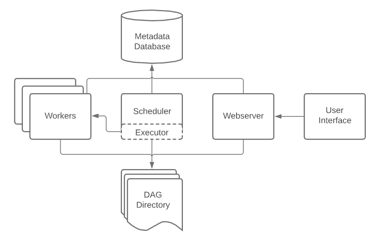

# Airflow 

## **Architecture**

- A [`scheduler`](https://airflow.apache.org/docs/apache-airflow/stable/administration-and-deployment/scheduler.html), which handles both triggering scheduled workflows, and submitting [Tasks](https://airflow.apache.org/docs/apache-airflow/stable/core-concepts/tasks.html) to the executor to run.
- An [`executor`](https://airflow.apache.org/docs/apache-airflow/stable/core-concepts/executor/index.html), which handles running tasks. In the default Airflow installation, this runs everything *inside* the scheduler, but most production-suitable executors actually push task execution out to *workers*.
- A *`webserver`*, which presents a handy user interface to inspect, trigger and debug the behaviour of DAGs and tasks.
- A folder of *DAG files*, read by the scheduler and executor (and any workers the executor has)
- A *metadata database*, used by the scheduler, executor and webserver to store state.

## Core Concepts

### [`Operators`](https://airflow.apache.org/docs/apache-airflow/stable/core-concepts/operators.html)

Predefined tasks that you can string together quickly to build most parts of your DAGs.

### [`Sensors`](https://airflow.apache.org/docs/apache-airflow/stable/core-concepts/sensors.html)

A special subclass of Operators which are entirely about waiting for an external event to happen.

### [`SubDAGs`](https://airflow.apache.org/docs/apache-airflow/stable/core-concepts/dags.html#concepts-subdags)

### Passing data between tasks

To pass data between tasks you have three options:

1. [XComs](https://airflow.apache.org/docs/apache-airflow/stable/core-concepts/xcoms.html) (“Cross-communications”), a system where you can have tasks push and pull small bits of metadata.
2. Uploading and downloading large files from a storage service (either one you run, or part of a public cloud)
3. TaskFlow API automatically passes data between tasks via implicit [XComs](https://airflow.apache.org/docs/apache-airflow/stable/core-concepts/xcoms.html)

# Refrences

[Core Concepts — Airflow Documentation](https://airflow.apache.org/docs/apache-airflow/stable/core-concepts/index.html)