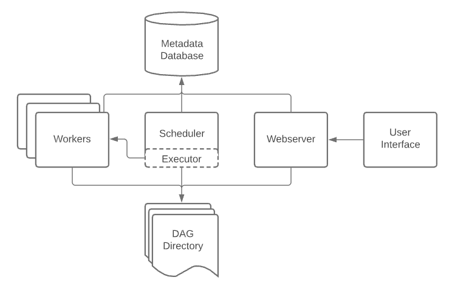

# Airflow 

## **Architecture**



- A [`scheduler`](https://airflow.apache.org/docs/apache-airflow/stable/administration-and-deployment/scheduler.html), which handles both triggering scheduled workflows, and submitting [Tasks](https://airflow.apache.org/docs/apache-airflow/stable/core-concepts/tasks.html) to the executor to run.
- An [`executor`](https://airflow.apache.org/docs/apache-airflow/stable/core-concepts/executor/index.html), which handles running tasks. In the default Airflow installation, this runs everything *inside* the scheduler, but most production-suitable executors actually push task execution out to *workers*.
- A *`webserver`*, which presents a handy user interface to inspect, trigger and debug the behaviour of DAGs and tasks.
- A folder of *DAG files*, read by the scheduler and executor (and any workers the executor has)
- A *metadata database*, used by the scheduler, executor and webserver to store state.

## Core Concepts

### [`Operators`](https://airflow.apache.org/docs/apache-airflow/stable/core-concepts/operators.html)

Predefined tasks that you can string together quickly to build most parts of your DAGs.

### [`Sensors`](https://airflow.apache.org/docs/apache-airflow/stable/core-concepts/sensors.html)

A special subclass of Operators which are entirely about waiting for an external event to happen.

### [`SubDAGs`](https://airflow.apache.org/docs/apache-airflow/stable/core-concepts/dags.html#concepts-subdags)

### Passing data between tasks

To pass data between tasks you have three options:

1. [XComs](https://airflow.apache.org/docs/apache-airflow/stable/core-concepts/xcoms.html) (“Cross-communications”), a system where you can have tasks push and pull small bits of metadata.
2. Uploading and downloading large files from a storage service (either one you run, or part of a public cloud)
3. TaskFlow API automatically passes data between tasks via implicit [XComs](https://airflow.apache.org/docs/apache-airflow/stable/core-concepts/xcoms.html)

### [Catchup](https://airflow.apache.org/docs/apache-airflow/stable/core-concepts/dag-run.html#catchup)
The scheduler, by default, will kick off a DAG Run for any data interval that has not been run since the last data interval. This concept is called Catchup.
```python
"""
Code that goes along with the Airflow tutorial located at:
https://github.com/apache/airflow/blob/main/airflow/example_dags/tutorial.py
"""
from airflow.models.dag import DAG
from airflow.operators.bash import BashOperator

import datetime
import pendulum

dag = DAG(
    "tutorial",
    default_args={
        "depends_on_past": True,
        "retries": 1,
        "retry_delay": datetime.timedelta(minutes=3),
    },
    start_date=pendulum.datetime(2015, 12, 1, tz="UTC"),
    description="A simple tutorial DAG",
    schedule="@daily",
    catchup=False,
)
```
In the example above, if the DAG is picked up by the scheduler daemon on 2016-01-02 at 6 AM, (or from the command line), a single DAG Run will be created with a data between 2016-01-01 and 2016-01-02, and the next one will be created just after midnight on the morning of 2016-01-03 with a data interval between 2016-01-02 and 2016-01-03. If the `dag.catchup` value had been `True` instead, the scheduler would have created a DAG Run for each completed interval between 2015-12-01 and 2016-01-02 (but not yet one for 2016-01-02, as that interval hasn’t completed) and the scheduler will execute them sequentially.

### Airflow Task Parallelism and Pool

[Pools](https://airflow.apache.org/docs/apache-airflow/stable/administration-and-deployment/pools.html#using-multiple-pool-slots)

#### [parallelism/AIRFLOW__CORE__PARALLELISM](https://airflow.apache.org/docs/apache-airflow/stable/configurations-ref.html#parallelism)

> This defines the maximum number of task instances that can run concurrently **per scheduler** in Airflow, regardless of the worker count. Generally this value, multiplied by the number of schedulers in your cluster, is the maximum number of task instances with the running state in the metadata database. The default value is 32.

#### [default_pool_task_slot_count/AIRFLOW__CORE__DEFAULT_POOL_TASK_SLOT_COUNT](https://airflow.apache.org/docs/apache-airflow/stable/configurations-ref.html#default-pool-task-slot-count)

> Task Slot counts for `default_pool`. This setting would not have any effect in an existing deployment where the `default_pool` is already created. For existing deployments, users can change the number of slots using Webserver, API or the CLI.

#### [max_active_tasks_per_dag/AIRFLOW__CORE__MAX_ACTIVE_TASKS_PER_DAG](https://airflow.apache.org/docs/apache-airflow/stable/configurations-ref.html#max-active-tasks-per-dag)

> The maximum number of task instances allowed to run concurrently in each DAG. To calculate the number of tasks that is running concurrently for a DAG, add up the number of running tasks for all DAG runs of the DAG. This is configurable at the DAG level with `max_active_tasks`, which is defaulted as `max_active_tasks_per_dag`.
> An example scenario when this would be useful is when you want to stop a new dag with an early start date from stealing all the executor slots in a cluster.

#### [max_active_runs_per_dag/AIRFLOW__CORE__MAX_ACTIVE_RUNS_PER_DAG](https://airflow.apache.org/docs/apache-airflow/stable/configurations-ref.html#max-active-runs-per-dag)

> The maximum number of active DAG runs per DAG. The scheduler will not create more DAG runs if it reaches the limit. This is configurable at the DAG level with max_active_runs, which is defaulted as `max_active_runs_per_dag`.


## D2 (Day to Day)

### [backfill](https://airflow.apache.org/docs/apache-airflow/stable/core-concepts/dag-run.html#backfill)

```bash
airflow dags backfill \
    --start-date 2021-01-23T00:00:00 \
    --end-date 2021-01-23T00:00:00 \
    dag_id
```
Note: start and date both are inclusive. Full list of options can be found [here](https://airflow.apache.org/docs/apache-airflow/stable/cli-and-env-variables-ref.html#backfill)


## Issues/Errors and Resolutions

> [Airflow DAG fails when PythonOperator with error "Negsignal.SIGKILL"](https://stackoverflow.com/questions/69231797/airflow-dag-fails-when-pythonoperator-with-error-negsignal-sigkill)
- Can be issue of memory, try increasing the memory of your pod.

## Refrences

[Core Concepts — Airflow Documentation](https://airflow.apache.org/docs/apache-airflow/stable/core-concepts/index.html)
